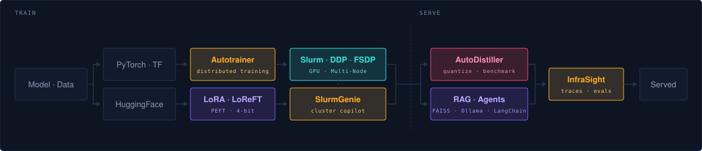

# Suhas Goravale Siddaramu

**I work on the layer between a model and the metal it runs on.**

Computer Research Scientist, AI at Universitätsklinikum Tübingen. Five years
of getting models to run somewhere real — distributed across a Slurm cluster,
served through a traced inference pipeline, or running entirely offline on
someone's own machine.

**Focus** — Distributed training on Slurm · LLM PEFT fine-tuning · Quantization & inference optimization · Agentic RAG

📍 Reutlingen, Germany &nbsp;·&nbsp; 🌐 **[orialpha.github.io](https://orialpha.github.io)** &nbsp;·&nbsp; 💼 [LinkedIn](https://www.linkedin.com/in/goravalesuhas)

---

### What I'm building

| | | |
|---|---|---|
| **[AutoDistiller](https://github.com/OriAlpha/autodistiller)** | Automatically find the best LLM deployment configuration for your hardware and quality constraints. Compresses candidates (AWQ, FP8, INT8), evaluates accuracy retention, and benchmarks in real vLLM/llama.cpp servers. | `Python` |
| **[Autotrainer](https://github.com/OriAlpha/Autotrainer)** | Hand it a model and data — it finds the hardware, picks the distribution strategy, and infers the training recipe. PyTorch DDP, Slurm multi-node, TensorFlow, scikit-learn through one API. | `Python` |
| **[SlurmGenie](https://github.com/OriAlpha/SlurmGenie)** | An offline copilot for Slurm GPU clusters. Diagnoses failed jobs, watches GPU utilization, rewrites sbatch scripts. Installs air-gapped. | `Python` |
| **[InfraSight](https://github.com/OriAlpha/InfraSight)** | A transparent proxy that watches LLM, RAG and agent traffic — request logs, PII masking, nested agent traces, LLM-as-a-judge scoring. | `JavaScript` |
| **[The Vault](https://github.com/OriAlpha/Local-RAG-System)** | Local RAG that never leaves the machine. Ollama for generation, FAISS for millisecond retrieval, two models racing side by side. | `Python` |
| **[PivotDesk](https://github.com/OriAlpha/PivotDesk)** | Live pivot-point dashboard for NSE stocks, with a swing panel of moving averages, RSI, MACD, Supertrend and ATR. | `Python` |

Where I've worked

 

| Role | Where | When |
|---|---|---|
| **Computer Research Scientist, AI** | Universitätsklinikum Tübingen | Aug 2024 — present |
| **Deep Learning Inference Engineer** | Ella Lab GmbH, Köln | Apr 2022 — Jul 2024 |
| **Machine Learning Engineer, Innovation** | Clinomic GmbH, Aachen | Jan 2021 — Mar 2022 |
| Working Student, Data Science & AI | Aptiv Services Germany GmbH | Apr 2019 — Dec 2020 |

M.Sc. Embedded Systems, TU Chemnitz · B.E. Electronics & Communication, VTU

---

### Stack

- **LLM & retrieval** — HuggingFace · LangChain · Ollama · FAISS · vector databases
- **Training & inference** — PyTorch · DDP · FSDP · vLLM · llama.cpp · TensorFlow · Keras · ONNX · TVM · scikit-learn · OpenCV
- **Clusters & MLOps** — Slurm · Docker · Kubernetes · Podman · Argo Workflows · GitLab CI · GitHub Actions · GCP · AWS
- **Languages** — Python · Bash · SQL · C

---

Open to ML infrastructure & engineering opportunities. Happy to discuss LLM fine-tuning, agentic pipelines,
distributed training, cluster scheduling, or inference optimization.
